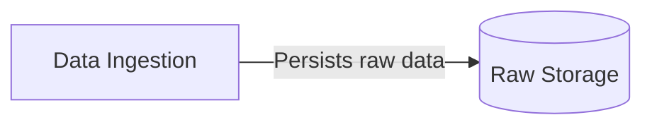
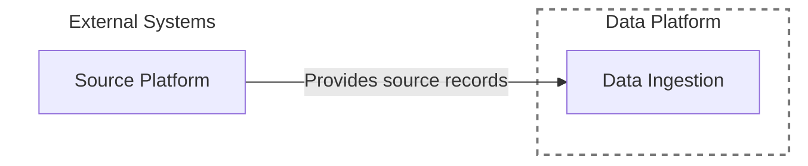
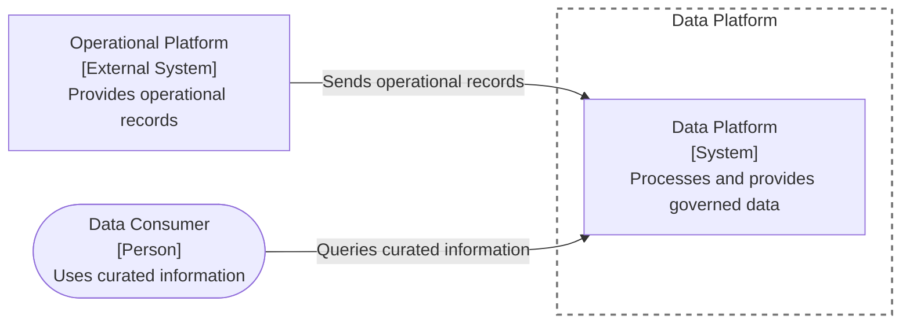
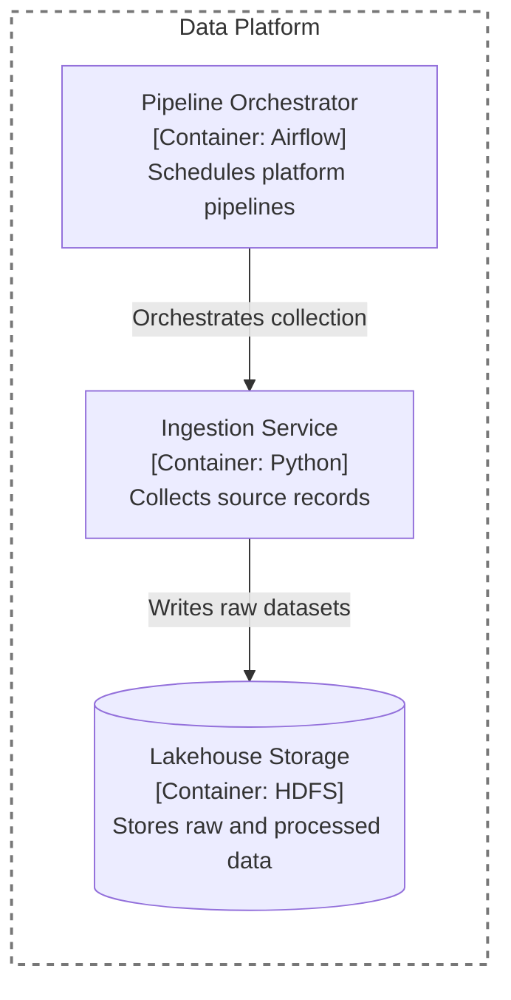
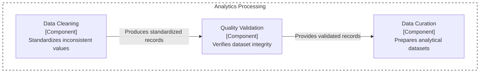
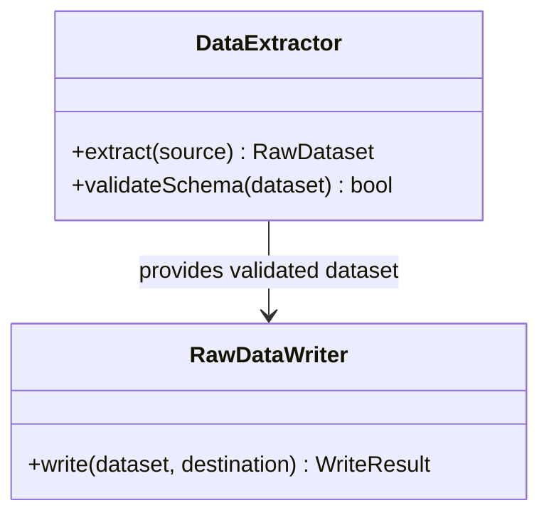

# C4 Mermaid Standard

Use these rules as the source of truth for C4 diagrams in this repository.

## Core notation

Use Mermaid `flowchart` for C4 levels 1–3 and `classDiagram` for level 4.

| Concept | Shape | Purpose |
| --- | --- | --- |
| Entity | Rectangle | System, service, application, component, or process |
| Storage | Cylinder | Database, filesystem, lake, queue storage, or object store |
| Actor | Rounded/circular node | Person, role, consumer, or interacting external actor |

Use a solid directed arrow for data flow, communication, actions, reads, writes, and relationships. Label it with `verb + object`:



Avoid labels such as `Data`, `Flow`, `Communication`, or `Integration` because they do not state purpose.

## Boundaries

Use subgraphs to separate internal systems, external systems, architectural domains, ownership, or trust zones. Use uppercase, stable identifiers and functional display names.



## Level 1 — Context

Show people or roles, the real system in focus, external systems, and high-level interactions. Do not show technologies, containers, databases, modules, classes, or implementation details.

Format nodes as:

```text
Name
[Person | System | External System]
Responsibility or interaction
```



## Level 2 — Container

Show applications, APIs, workers, orchestration engines, storage, databases, queues, and other runtime or deployable units. Technology is allowed when it clarifies implementation.

Format nodes as:

```text
Functional name
[Container: Technology]
Clear responsibility
```



Use cylinders for databases and storage. Do not represent storage as a person or external actor.

## Level 3 — Component

Show internal responsibilities of exactly one container. Use functional component names and avoid classes, methods, and unrelated containers.

Format nodes as:

```text
Functional name
[Component]
Specific responsibility
```



## Level 4 — Code/UML

Use `classDiagram` to show classes, interfaces, methods, attributes, and their relationships. Create this level only for explicit code-design needs.



Keep signatures aligned with the implementation when source code exists. Do not invent public methods or dependencies without marking them as proposed.

## Quality rules

- Use real role, system, container, and component names; avoid generic terms.
- Keep one C4 abstraction level in each diagram.
- Make the system in focus and each boundary unambiguous.
- Give every relationship a direction and purpose.
- Describe responsibilities, not only technologies.
- Show sensitive-data and trust boundaries when relevant.
- Show gateways or mediators when access is not direct.
- Prefer a readable diagram over exhaustive detail; split crowded diagrams.
