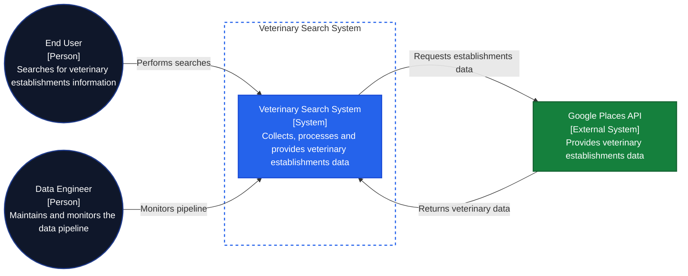

```mermaid
flowchart LR

    USER(("End User<br/>[Person]<br/>Searches for veterinary establishments information"))

    ENGINEER(("Data Engineer<br/>[Person]<br/>Maintains and monitors the data pipeline"))

    GOOGLE["Google Places API<br/>[External System]<br/>Provides veterinary establishments data"]

    subgraph VET_PLATFORM_BOUNDARY["Veterinary Search System"]

        PLATFORM["Veterinary Search System<br/>[System]<br/>Collects, processes and provides veterinary establishments data"]

    end

    USER -->|Performs searches| PLATFORM

    ENGINEER -->|Monitors pipeline| PLATFORM

    PLATFORM -->|Requests establishments data| GOOGLE

    GOOGLE -->|Returns veterinary data| PLATFORM


    %% =========================
    %% STANDARD COLORS
    %% =========================

    %% Actors
    classDef actor fill:#0F172A,stroke:#1E3A8A,color:#FFFFFF,stroke-width:2px;

    %% Internal System
    classDef internal fill:#2563EB,stroke:#1D4ED8,color:#FFFFFF,stroke-width:2px;

    %% External System
    classDef external fill:#15803D,stroke:#166534,color:#FFFFFF,stroke-width:2px;

    %% Boundary
    style VET_PLATFORM_BOUNDARY fill:none,stroke:#2563EB,stroke-width:2px,stroke-dasharray: 5 5

    %% Class assignment
    class USER,ENGINEER actor;
    class PLATFORM internal;
    class GOOGLE external;
```
