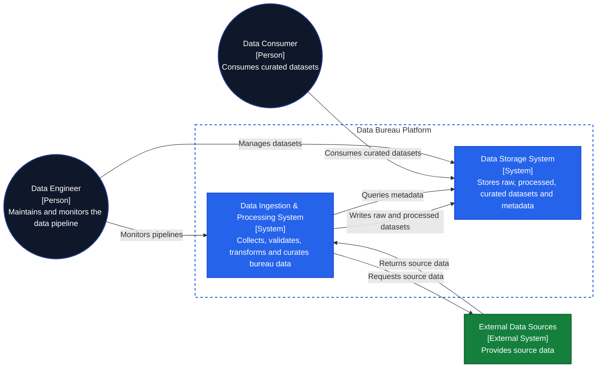

```mermaid
flowchart LR

    USER(("Data Consumer<br/>[Person]<br/>Consumes curated datasets"))

    ENGINEER(("Data Engineer<br/>[Person]<br/>Maintains and monitors the data pipeline"))

    SOURCES["External Data Sources<br/>[External System]<br/>Provides source data"]

    subgraph DATA_BUREAU_BOUNDARY["Data Bureau Platform"]

        INGESTION_PROCESSING["Data Ingestion & Processing System<br/>[System]<br/>Collects, validates, transforms and curates bureau data"]

        STORAGE_SYSTEM["Data Storage System<br/>[System]<br/>Stores raw, processed, curated datasets and metadata"]

    end

    INGESTION_PROCESSING -->|Requests source data| SOURCES

    SOURCES -->|Returns source data| INGESTION_PROCESSING

    INGESTION_PROCESSING -->|Writes raw and processed datasets| STORAGE_SYSTEM

    INGESTION_PROCESSING -->|Queries metadata| STORAGE_SYSTEM

    USER -->|Consumes curated datasets| STORAGE_SYSTEM

    ENGINEER -->|Monitors pipelines| INGESTION_PROCESSING

    ENGINEER -->|Manages datasets| STORAGE_SYSTEM

    %% =========================
    %% STANDARD COLORS
    %% =========================

    %% Actors
    classDef actor fill:#0F172A,stroke:#1E3A8A,color:#FFFFFF,stroke-width:2px;

    %% Internal System
    classDef internal fill:#2563EB,stroke:#1D4ED8,color:#FFFFFF,stroke-width:2px;

    %% External System
    classDef external fill:#15803D,stroke:#166534,color:#FFFFFF,stroke-width:2px;

    %% Boundary
    style DATA_BUREAU_BOUNDARY fill:none,stroke:#2563EB,stroke-width:2px,stroke-dasharray: 5 5

    %% Class assignment
    class USER,ENGINEER actor;
    class INGESTION_PROCESSING,STORAGE_SYSTEM internal;
    class SOURCES external;
```
