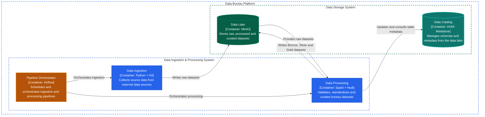

```mermaid
flowchart LR

    %% =====================================================
    %% SYSTEM BOUNDARY
    %% =====================================================

    subgraph DATA_BUREAU_BOUNDARY["Data Bureau Platform"]

        direction LR

        %% =================================================
        %% INGESTION AND PROCESSING SYSTEM
        %% =================================================

        subgraph INGESTION_PROCESSING_BOUNDARY["Data Ingestion & Processing System"]

            direction TB

            %% =============================================
            %% ORCHESTRATION
            %% =============================================

            AIRFLOW["Pipeline Orchestrator<br/>[Container: Airflow]<br/>Schedules and orchestrates ingestion and processing pipelines"]

            %% =============================================
            %% INGESTION
            %% =============================================

            INGESTION["Data Ingestion<br/>[Container: Python + H3]<br/>Collects source data from external data sources"]

            %% =============================================
            %% PROCESSING
            %% =============================================

            PROCESSING["Data Processing<br/>[Container: Spark + Hudi]<br/>Validates, standardizes and curates bureau datasets"]

        end

        %% =================================================
        %% DATA STORAGE SYSTEM
        %% =================================================

        subgraph DATA_STORAGE_BOUNDARY["Data Storage System"]

            direction TB

            %% =============================================
            %% STORAGE
            %% =============================================

            STORAGE[("Data Lake<br/>[Container: MinIO]<br/>Stores raw, processed and curated datasets")]

            %% =============================================
            %% METADATA
            %% =============================================

            CATALOG[("Data Catalog<br/>[Container: HUDI Metastore]<br/>Manages schemas and metadata from the data lake")]

        end

    end

    %% =====================================================
    %% FLOWS
    %% =====================================================

    AIRFLOW -->|Orchestrates ingestion| INGESTION

    AIRFLOW -->|Orchestrates processing| PROCESSING

    INGESTION -->|Writes raw datasets| STORAGE
     
    STORAGE -->|Provides raw datasets| PROCESSING

    PROCESSING -->|Writes Bronze, Silver and Gold datasets| STORAGE

    PROCESSING -->|Updates and consults table metadata| CATALOG

    %% =====================================================
    %% COLORS
    %% =====================================================

    %% Internal Containers
    classDef internal fill:#2563EB,stroke:#1D4ED8,color:#FFFFFF,stroke-width:2px;

    %% Storage
    classDef storage fill:#065F46,stroke:#047857,color:#FFFFFF,stroke-width:2px;

    %% Orchestration
    classDef orchestration fill:#B45309,stroke:#D97706,color:#FFFFFF,stroke-width:2px;

    %% Metadata
    classDef metadata fill:#0F766E,stroke:#14B8A6,color:#FFFFFF,stroke-width:2px;

    %% Boundary
    style DATA_BUREAU_BOUNDARY fill:none,stroke:#2563EB,stroke-width:2px,stroke-dasharray: 5 5
    style INGESTION_PROCESSING_BOUNDARY fill:none,stroke:#2563EB,stroke-width:2px,stroke-dasharray: 5 5
    style DATA_STORAGE_BOUNDARY fill:none,stroke:#065F46,stroke-width:2px,stroke-dasharray: 5 5

    %% =====================================================
    %% CLASS ASSIGNMENT
    %% =====================================================

    class INGESTION,PROCESSING internal;
    class STORAGE storage;
    class AIRFLOW orchestration;
    class CATALOG metadata;
```
