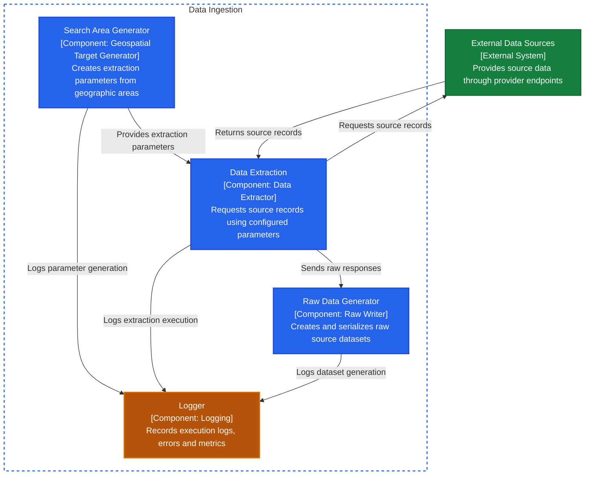

```mermaid
flowchart TB

    %% =====================================================
    %% EXTERNAL SYSTEMS
    %% =====================================================

    SOURCES["External Data Sources<br/>[External System]<br/>Provides source data through provider endpoints"]

    %% =====================================================
    %% CONTAINER BOUNDARY
    %% =====================================================

    subgraph INGESTION_BOUNDARY["Data Ingestion"]

        direction TB

        SEARCH_AREA_GENERATOR["Search Area Generator<br/>[Component: Geospatial Target Generator]<br/>Creates extraction parameters from geographic areas"]

        EXTRACTION["Data Extraction<br/>[Component: Data Extractor]<br/>Requests source records using configured parameters"]

        RAW["Raw Data Generator<br/>[Component: Raw Writer]<br/>Creates and serializes raw source datasets"]

        LOGGER["Logger<br/>[Component: Logging]<br/>Records execution logs, errors and metrics"]

    end

    %% =====================================================
    %% FLOWS
    %% =====================================================

    SEARCH_AREA_GENERATOR -->|Provides extraction parameters| EXTRACTION

    EXTRACTION -->|Requests source records| SOURCES

    SOURCES -->|Returns source records| EXTRACTION

    EXTRACTION -->|Sends raw responses| RAW

    SEARCH_AREA_GENERATOR -->|Logs parameter generation| LOGGER

    EXTRACTION -->|Logs extraction execution| LOGGER

    RAW -->|Logs dataset generation| LOGGER

    %% =====================================================
    %% COLORS
    %% =====================================================

    classDef component fill:#2563EB,stroke:#1D4ED8,color:#FFFFFF,stroke-width:2px;
    classDef logger fill:#B45309,stroke:#D97706,color:#FFFFFF,stroke-width:2px;
    classDef external fill:#15803D,stroke:#166534,color:#FFFFFF,stroke-width:2px;

    style INGESTION_BOUNDARY fill:none,stroke:#2563EB,stroke-width:2px,stroke-dasharray: 5 5

    %% =====================================================
    %% CLASS ASSIGNMENT
    %% =====================================================

    class SEARCH_AREA_GENERATOR,EXTRACTION,RAW component;
    class LOGGER logger;
    class SOURCES external;
```
