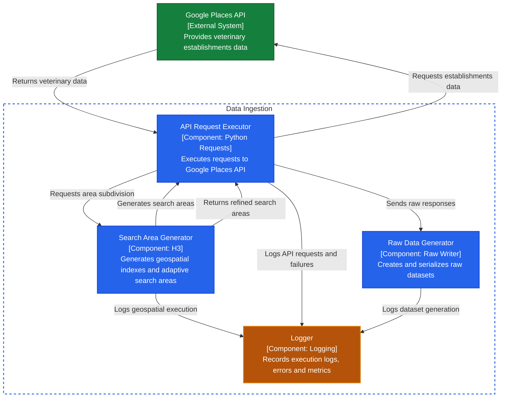

```mermaid
flowchart TB

    %% =====================================================
    %% EXTERNAL SYSTEM
    %% =====================================================

    GOOGLE["Google Places API<br/>[External System]<br/>Provides veterinary establishments data"]

    %% =====================================================
    %% CONTAINER BOUNDARY
    %% =====================================================

    subgraph INGESTION_BOUNDARY["Data Ingestion"]

        direction TB

        H3["Search Area Generator<br/>[Component: H3]<br/>Generates geospatial indexes and adaptive search areas"]

        REQUEST["API Request Executor<br/>[Component: Python Requests]<br/>Executes requests to Google Places API"]

        RAW["Raw Data Generator<br/>[Component: Raw Writer]<br/>Creates and serializes raw datasets"]

        LOGGER["Logger<br/>[Component: Logging]<br/>Records execution logs, errors and metrics"]

    end

    %% =====================================================
    %% FLOWS
    %% =====================================================

    H3 -->|Generates search areas| REQUEST

    REQUEST -->|Requests establishments data| GOOGLE

    GOOGLE -->|Returns veterinary data| REQUEST

    REQUEST -->|Sends raw responses| RAW

    REQUEST -->|Requests area subdivision| H3

    H3 -->|Returns refined search areas| REQUEST

    H3 -->|Logs geospatial execution| LOGGER

    REQUEST -->|Logs API requests and failures| LOGGER

    RAW -->|Logs dataset generation| LOGGER

    %% =====================================================
    %% COLORS
    %% =====================================================

    %% Components
    classDef component fill:#2563EB,stroke:#1D4ED8,color:#FFFFFF,stroke-width:2px;

    %% Logger
    classDef logger fill:#B45309,stroke:#D97706,color:#FFFFFF,stroke-width:2px;

    %% External System
    classDef external fill:#15803D,stroke:#166534,color:#FFFFFF,stroke-width:2px;

    %% Boundary
    style INGESTION_BOUNDARY fill:none,stroke:#2563EB,stroke-width:2px,stroke-dasharray: 5 5

    %% =====================================================
    %% CLASS ASSIGNMENT
    %% =====================================================

    class H3,REQUEST,RAW component;
    class LOGGER logger;
    class GOOGLE external;
```
