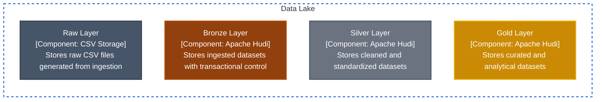

```mermaid
flowchart TB

    %% =====================================================
    %% CONTAINER BOUNDARY
    %% =====================================================

    subgraph DATALAKE_BOUNDARY["Data Lake"]

        direction TB

        RAW["Raw Layer<br/>[Component: CSV Storage]<br/>Stores raw CSV files generated from ingestion"]

        BRONZE["Bronze Layer<br/>[Component: Apache Hudi]<br/>Stores ingested datasets with transactional control"]

        SILVER["Silver Layer<br/>[Component: Apache Hudi]<br/>Stores cleaned and standardized datasets"]

        GOLD["Gold Layer<br/>[Component: Apache Hudi]<br/>Stores curated and analytical datasets"]

    end

    %% =====================================================
    %% COLORS
    %% =====================================================

    %% Raw
    classDef raw fill:#475569,stroke:#334155,color:#FFFFFF,stroke-width:2px;

    %% Bronze
    classDef bronze fill:#92400E,stroke:#B45309,color:#FFFFFF,stroke-width:2px;

    %% Silver
    classDef silver fill:#6B7280,stroke:#4B5563,color:#FFFFFF,stroke-width:2px;

    %% Gold
    classDef gold fill:#CA8A04,stroke:#EAB308,color:#FFFFFF,stroke-width:2px;

    %% Boundary
    style DATALAKE_BOUNDARY fill:none,stroke:#2563EB,stroke-width:2px,stroke-dasharray: 5 5

    %% =====================================================
    %% CLASS ASSIGNMENT
    %% =====================================================

    class RAW raw;
    class BRONZE bronze;
    class SILVER silver;
    class GOLD gold;
```
