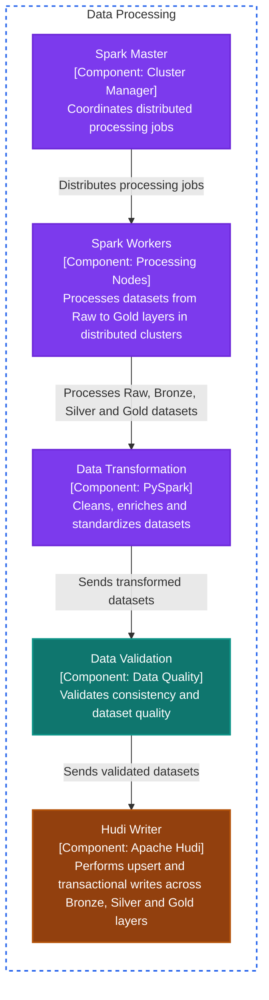

```mermaid
flowchart TB

    %% =====================================================
    %% CONTAINER BOUNDARY
    %% =====================================================

    subgraph PROCESSING_BOUNDARY["Data Processing"]

        direction TB

        SPARK_MASTER["Spark Master<br/>[Component: Cluster Manager]<br/>Coordinates distributed processing jobs"]

        WORKERS["Spark Workers<br/>[Component: Processing Nodes]<br/>Processes datasets from Raw to Gold layers in distributed clusters"]

        TRANSFORM["Data Transformation<br/>[Component: PySpark]<br/>Cleans, enriches and standardizes datasets"]

        VALIDATION["Data Validation<br/>[Component: Data Quality]<br/>Validates consistency and dataset quality"]

        HUDI["Hudi Writer<br/>[Component: Apache Hudi]<br/>Performs upsert and transactional writes across Bronze, Silver and Gold layers"]

    end

    %% =====================================================
    %% FLOWS
    %% =====================================================

    SPARK_MASTER -->|Distributes processing jobs| WORKERS

    WORKERS -->|Processes Raw, Bronze, Silver and Gold datasets| TRANSFORM

    TRANSFORM -->|Sends transformed datasets| VALIDATION

    VALIDATION -->|Sends validated datasets| HUDI    

    %% =====================================================
    %% COLORS
    %% =====================================================

    %% Spark Components
    classDef spark fill:#7C3AED,stroke:#6D28D9,color:#FFFFFF,stroke-width:2px;

    %% Hudi Components
    classDef hudi fill:#92400E,stroke:#B45309,color:#FFFFFF,stroke-width:2px;

    %% Validation
    classDef validation fill:#0F766E,stroke:#0D9488,color:#FFFFFF,stroke-width:2px;

    %% Boundary
    style PROCESSING_BOUNDARY fill:none,stroke:#2563EB,stroke-width:2px,stroke-dasharray: 5 5

    %% =====================================================
    %% CLASS ASSIGNMENT
    %% =====================================================

    class SPARK_MASTER,WORKERS,TRANSFORM spark;

    class HUDI hudi;

    class VALIDATION validation;
```
