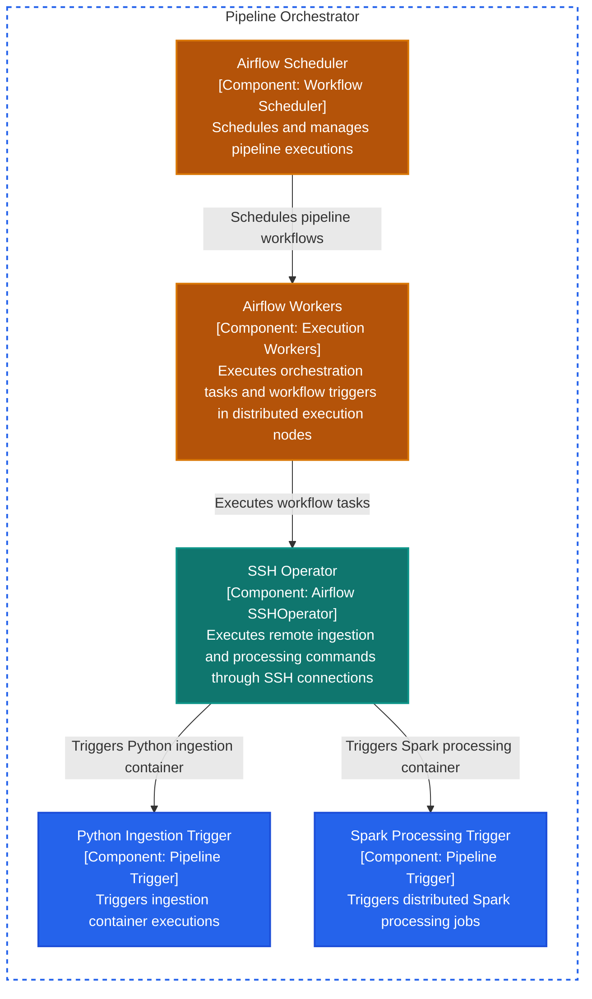

```mermaid
flowchart TB

    %% =====================================================
    %% CONTAINER BOUNDARY
    %% =====================================================

    subgraph ORCHESTRATOR_BOUNDARY["Pipeline Orchestrator"]

        direction TB

        SCHEDULER["Airflow Scheduler<br/>[Component: Workflow Scheduler]<br/>Schedules and manages pipeline executions"]

        WORKERS["Airflow Workers<br/>[Component: Execution Workers]<br/>Executes orchestration tasks and workflow triggers in distributed execution nodes"]

        OPERATOR["SSH Operator<br/>[Component: Airflow SSHOperator]<br/>Executes remote ingestion and processing commands through SSH connections"]

        PYTHON["Python Ingestion Trigger<br/>[Component: Pipeline Trigger]<br/>Triggers ingestion container executions"]

        SPARK["Spark Processing Trigger<br/>[Component: Pipeline Trigger]<br/>Triggers distributed Spark processing jobs"]

    end

    %% =====================================================
    %% FLOWS
    %% =====================================================

    SCHEDULER -->|Schedules pipeline workflows| WORKERS

    WORKERS -->|Executes workflow tasks| OPERATOR

    OPERATOR -->|Triggers Python ingestion container| PYTHON

    OPERATOR -->|Triggers Spark processing container| SPARK

    %% =====================================================
    %% COLORS
    %% =====================================================

    %% Orchestrator Components
    classDef orchestration fill:#B45309,stroke:#D97706,color:#FFFFFF,stroke-width:2px;

    %% Operator
    classDef operator fill:#0F766E,stroke:#0D9488,color:#FFFFFF,stroke-width:2px;

    %% Trigger
    classDef trigger fill:#2563EB,stroke:#1D4ED8,color:#FFFFFF,stroke-width:2px;

    %% Boundary
    style ORCHESTRATOR_BOUNDARY fill:none,stroke:#2563EB,stroke-width:2px,stroke-dasharray: 5 5

    %% =====================================================
    %% CLASS ASSIGNMENT
    %% =====================================================

    class SCHEDULER,WORKERS orchestration;

    class OPERATOR operator;

    class PYTHON,SPARK trigger;
```
