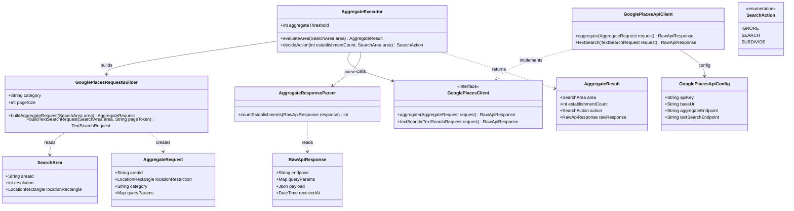

# Level 4 - Aggregate Executor

```mermaid
classDiagram
direction TB

class AggregateExecutor {
  +int aggregateThreshold
  +evaluateArea(SearchArea area) AggregateResult
  +decideAction(int establishmentCount, SearchArea area) SearchAction
}

class GooglePlacesRequestBuilder {
  +String category
  +int pageSize
  +buildAggregateRequest(SearchArea area) AggregateRequest
  +buildTextSearchRequest(SearchArea area, String pageToken) TextSearchRequest
}

class GooglePlacesClient {
  <<interface>>
  +aggregate(AggregateRequest request) RawApiResponse
  +textSearch(TextSearchRequest request) RawApiResponse
}

class GooglePlacesApiClient {
  +aggregate(AggregateRequest request) RawApiResponse
  +textSearch(TextSearchRequest request) RawApiResponse
}

class GooglePlacesApiConfig {
  +String apiKey
  +String baseUrl
  +String aggregateEndpoint
  +String textSearchEndpoint
}

class AggregateResponseParser {
  +countEstablishments(RawApiResponse response) int
}

class AggregateRequest {
  +String areaId
  +LocationRectangle locationRestriction
  +String category
  +Map queryParams
}

class AggregateResult {
  +SearchArea area
  +int establishmentCount
  +SearchAction action
  +RawApiResponse rawResponse
}

class SearchArea {
  +String areaId
  +int resolution
  +LocationRectangle locationRectangle
}

class RawApiResponse {
  +String endpoint
  +Map queryParams
  +Json payload
  +DateTime receivedAt
}

class SearchAction {
  <<enumeration>>
  IGNORE
  SEARCH
  SUBDIVIDE
}

AggregateExecutor --> GooglePlacesRequestBuilder : builds
AggregateExecutor --> GooglePlacesClient : calls
AggregateExecutor --> AggregateResponseParser : parses
AggregateExecutor ..> AggregateResult : returns

GooglePlacesRequestBuilder --> SearchArea : reads
GooglePlacesRequestBuilder ..> AggregateRequest : creates

GooglePlacesApiClient ..|> GooglePlacesClient : implements
GooglePlacesApiClient --> GooglePlacesApiConfig : config
AggregateResponseParser ..> RawApiResponse : reads
```
