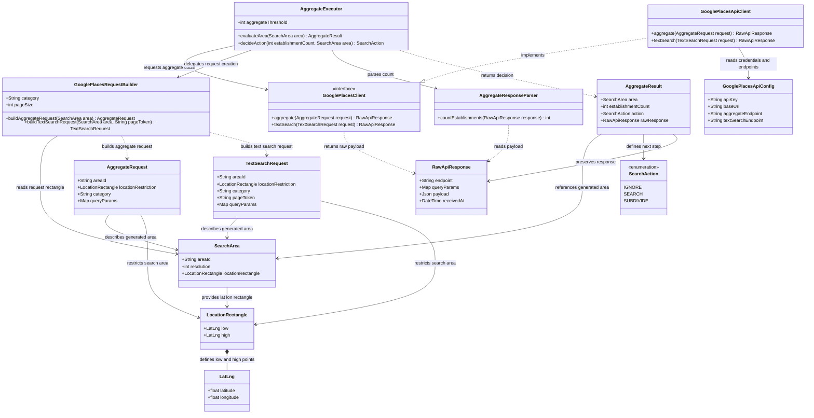

# Level 4 - Aggregate Executor

```mermaid
classDiagram

class AggregateExecutor {
  +int aggregateThreshold
  +evaluateArea(SearchArea area) AggregateResult
  +decideAction(int establishmentCount, SearchArea area) SearchAction
}

class GooglePlacesRequestBuilder {
  +String category
  +int pageSize
  +buildAggregateRequest(SearchArea area) AggregateRequest
  +buildTextSearchRequest(SearchArea area, String pageToken) TextSearchRequest
}

class GooglePlacesClient {
  <<interface>>
  +aggregate(AggregateRequest request) RawApiResponse
  +textSearch(TextSearchRequest request) RawApiResponse
}

class GooglePlacesApiClient {
  +aggregate(AggregateRequest request) RawApiResponse
  +textSearch(TextSearchRequest request) RawApiResponse
}

class GooglePlacesApiConfig {
  +String apiKey
  +String baseUrl
  +String aggregateEndpoint
  +String textSearchEndpoint
}

class AggregateRequest {
  +String areaId
  +LocationRectangle locationRestriction
  +String category
  +Map queryParams
}

class TextSearchRequest {
  +String areaId
  +LocationRectangle locationRestriction
  +String category
  +String pageToken
  +Map queryParams
}

class AggregateResult {
  +SearchArea area
  +int establishmentCount
  +SearchAction action
  +RawApiResponse rawResponse
}

class SearchAction {
  <<enumeration>>
  IGNORE
  SEARCH
  SUBDIVIDE
}

class SearchArea {
  +String areaId
  +int resolution
  +LocationRectangle locationRectangle
}

class LocationRectangle {
  +LatLng low
  +LatLng high
}

class LatLng {
  +float latitude
  +float longitude
}

class RawApiResponse {
  +String endpoint
  +Map queryParams
  +Json payload
  +DateTime receivedAt
}

class AggregateResponseParser {
  +countEstablishments(RawApiResponse response) int
}

AggregateExecutor --> GooglePlacesClient : requests aggregate count
AggregateExecutor --> GooglePlacesRequestBuilder : delegates request creation
AggregateExecutor --> AggregateResponseParser : parses count
AggregateExecutor ..> AggregateResult : returns decision

GooglePlacesRequestBuilder --> SearchArea : reads request rectangle
GooglePlacesRequestBuilder ..> AggregateRequest : builds aggregate request
GooglePlacesRequestBuilder ..> TextSearchRequest : builds text search request

GooglePlacesApiClient ..|> GooglePlacesClient : implements
GooglePlacesApiClient --> GooglePlacesApiConfig : reads credentials and endpoints
GooglePlacesClient ..> RawApiResponse : returns raw payload

AggregateRequest --> SearchArea : describes generated area
AggregateRequest --> LocationRectangle : restricts search area
TextSearchRequest --> SearchArea : describes generated area
TextSearchRequest --> LocationRectangle : restricts search area
AggregateResult --> SearchArea : references generated area
AggregateResult --> SearchAction : defines next step
AggregateResult --> RawApiResponse : preserves response
AggregateResponseParser ..> RawApiResponse : reads payload
SearchArea --> LocationRectangle : provides lat lon rectangle
LocationRectangle *-- LatLng : defines low and high points
```
