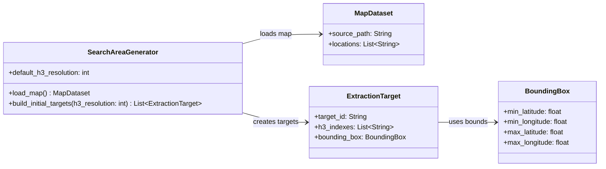

# Level 4 - Search Area Generator

Este diagrama de Level 4 Code/UML sugere uma estrutura minima para transformar uma area geografica em alvos de busca H3 com `bounding_box`. A resolucao H3 pode ser informada na execucao ou usar um valor padrao do `SearchAreaGenerator`.

## Assumptions

- O formato real do mapa ainda sera definido.
- `default_h3_resolution` e usado quando a chamada nao informar uma resolucao H3 especifica.
- As assinaturas sao exemplos para discutir o desenho.
