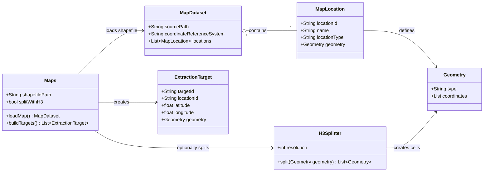

# Level 4 - Area Generator

```mermaid
classDiagram
direction LR

class Maps {
  +String shapefilePath
  +bool splitWithH3
  +loadMap() MapDataset
  +buildTargets() List~ExtractionTarget~
}

class MapDataset {
  +String sourcePath
  +String coordinateReferenceSystem
  +List~MapLocation~ locations
}

class MapLocation {
  +String locationId
  +String name
  +String locationType
  +Geometry geometry
}

class H3Splitter {
  +int resolution
  +split(Geometry geometry) List~Geometry~
}

class ExtractionTarget {
  +String targetId
  +String locationId
  +float latitude
  +float longitude
  +Geometry geometry
}

class Geometry {
  +String type
  +List coordinates
}

Maps --> MapDataset : loads shapefile
Maps --> H3Splitter : optionally splits
Maps --> ExtractionTarget : creates
MapDataset "1" o-- "*" MapLocation : contains
MapLocation --> Geometry : defines
H3Splitter --> Geometry : creates cells
```
