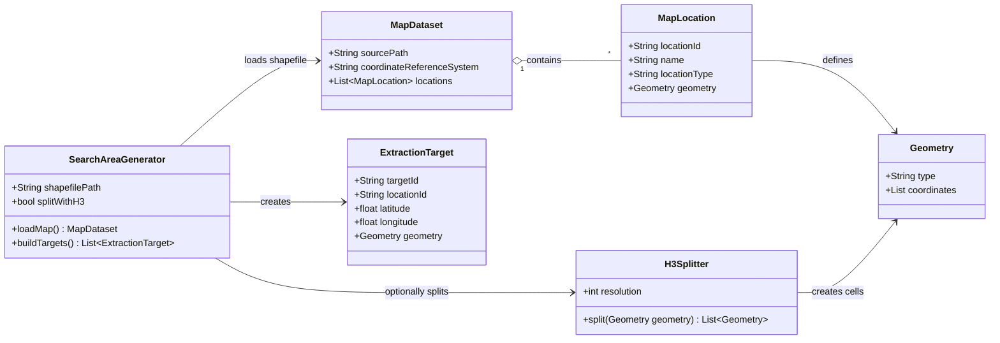

# Level 4 - Search Area Generator

Nota: `SearchAreaGenerator` é um componente específico deste projeto, porque a ingestão depende de áreas geográficas e células H3. Em outro contexto, os `ExtractionTarget` poderiam vir diretamente de configuração, IDs externos, filas, partições ou outro gerador de targets.

