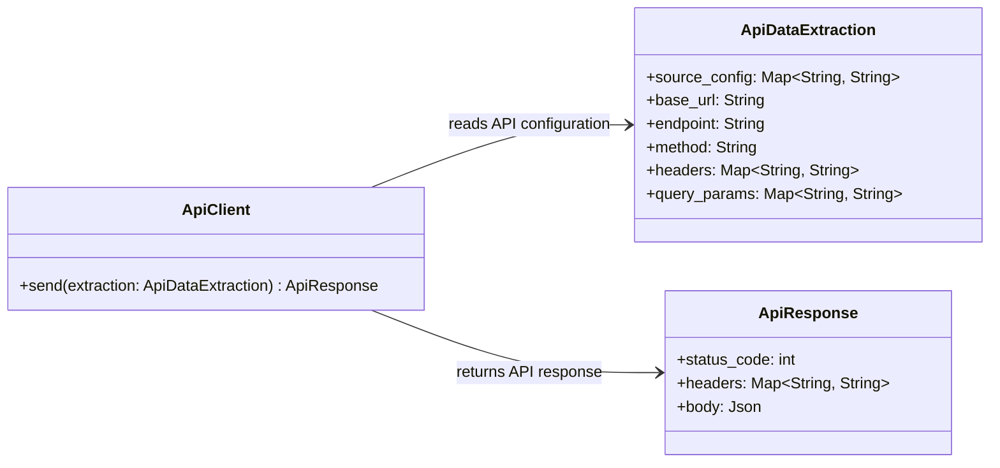

# Level 4 - Data Extraction

Este diagrama de Level 4 Code/UML sugere uma estrutura minima para enviar chamadas genericas para APIs HTTP externas. `ApiDataExtraction` expoe os atributos basicos da chamada, `ApiClient` executa o envio e `ApiResponse` representa o retorno.

## Assumptions

- "Qualquer API" significa qualquer API HTTP.
- `ApiDataExtraction` concentra a configuracao basica da chamada HTTP para esta POC.
- `ApiClient` recebe a extracao configurada e retorna `ApiResponse`.
- `headers` e `query_params` podem ficar vazios para APIs que nao exigem esses valores.
- Autenticacao, timeout, retry e paginacao automatica ficam fora desta POC.
