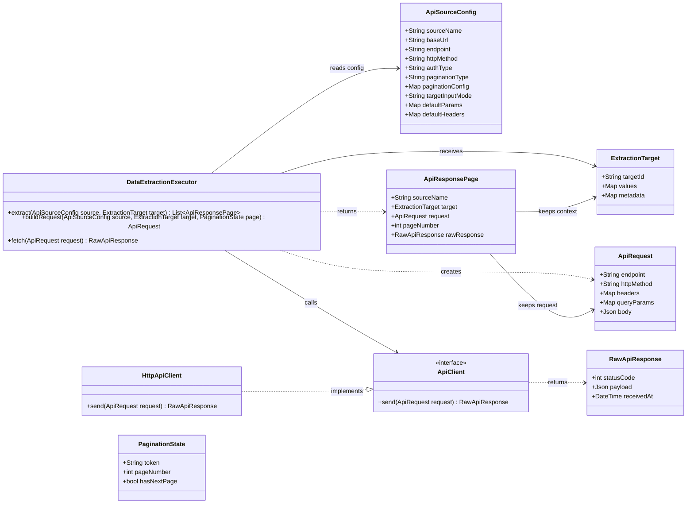

# Level 4 - Data Extraction

```mermaid
classDiagram
direction LR

class DataExtractionExecutor {
  +extract(ApiSourceConfig source, ExtractionTarget target) List~ApiResponsePage~
  +buildRequest(ApiSourceConfig source, ExtractionTarget target, PaginationState page) ApiRequest
  +fetch(ApiRequest request) RawApiResponse
}

class ExtractionTarget {
  +String targetId
  +Map values
  +Map metadata
}

class ApiSourceConfig {
  +String sourceName
  +String baseUrl
  +String endpoint
  +String httpMethod
  +String authType
  +String paginationType
  +Map paginationConfig
  +String targetInputMode
  +Map defaultParams
  +Map defaultHeaders
}

class ApiClient {
  <<interface>>
  +send(ApiRequest request) RawApiResponse
}

class HttpApiClient {
  +send(ApiRequest request) RawApiResponse
}

class ApiRequest {
  +String endpoint
  +String httpMethod
  +Map headers
  +Map queryParams
  +Json body
}

class ApiResponsePage {
  +String sourceName
  +ExtractionTarget target
  +ApiRequest request
  +int pageNumber
  +RawApiResponse rawResponse
}

class RawApiResponse {
  +int statusCode
  +Json payload
  +DateTime receivedAt
}

class PaginationState {
  +String token
  +int pageNumber
  +bool hasNextPage
}

DataExtractionExecutor --> ExtractionTarget : receives
DataExtractionExecutor --> ApiSourceConfig : reads config
DataExtractionExecutor ..> ApiRequest : creates
DataExtractionExecutor --> ApiClient : calls
DataExtractionExecutor ..> ApiResponsePage : returns
ApiResponsePage --> ExtractionTarget : keeps context
ApiResponsePage --> ApiRequest : keeps request
HttpApiClient ..|> ApiClient : implements
ApiClient ..> RawApiResponse : returns
```
