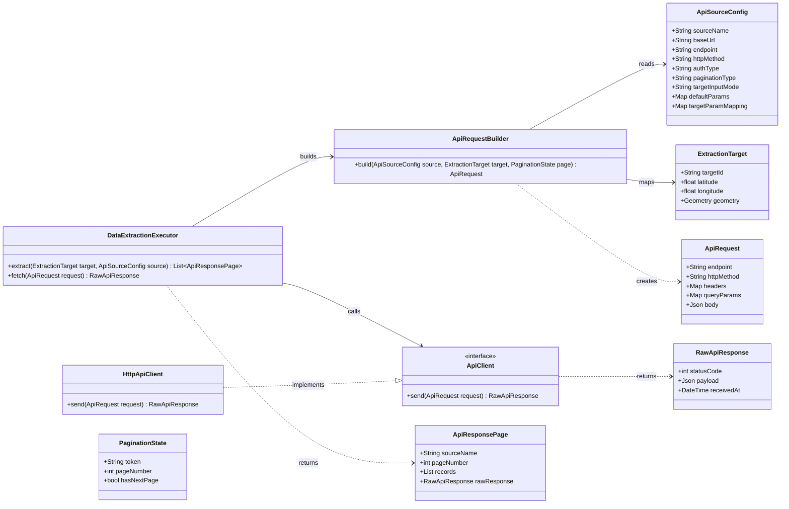

# Level 4 - Data Extraction

```mermaid
classDiagram
direction LR

class DataExtractionExecutor {
  +extract(ExtractionTarget target, ApiSourceConfig source) List~ApiResponsePage~
  +fetch(ApiRequest request) RawApiResponse
}

class ApiSourceConfig {
  +String sourceName
  +String baseUrl
  +String endpoint
  +String httpMethod
  +String authType
  +String paginationType
  +String targetInputMode
  +Map defaultParams
  +Map targetParamMapping
}

class ApiRequestBuilder {
  +build(ApiSourceConfig source, ExtractionTarget target, PaginationState page) ApiRequest
}

class ApiClient {
  <<interface>>
  +send(ApiRequest request) RawApiResponse
}

class HttpApiClient {
  +send(ApiRequest request) RawApiResponse
}

class ApiRequest {
  +String endpoint
  +String httpMethod
  +Map headers
  +Map queryParams
  +Json body
}

class ApiResponsePage {
  +String sourceName
  +int pageNumber
  +List records
  +RawApiResponse rawResponse
}

class ExtractionTarget {
  +String targetId
  +float latitude
  +float longitude
  +Geometry geometry
}

class RawApiResponse {
  +int statusCode
  +Json payload
  +DateTime receivedAt
}

class PaginationState {
  +String token
  +int pageNumber
  +bool hasNextPage
}

DataExtractionExecutor --> ApiRequestBuilder : builds
DataExtractionExecutor --> ApiClient : calls
DataExtractionExecutor ..> ApiResponsePage : returns
ApiRequestBuilder --> ApiSourceConfig : reads
ApiRequestBuilder --> ExtractionTarget : maps
ApiRequestBuilder ..> ApiRequest : creates
HttpApiClient ..|> ApiClient : implements
ApiClient ..> RawApiResponse : returns
```
