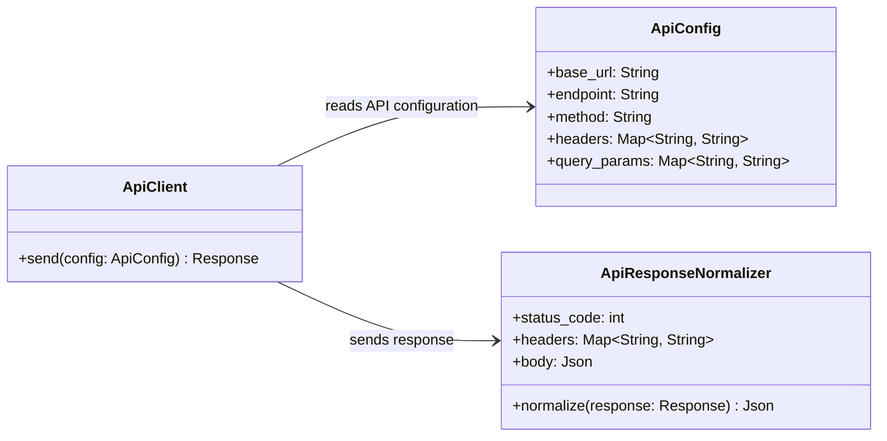

# Level 4 - Data Extraction New

Este diagrama de Level 4 Code/UML sugere uma estrutura minima para enviar chamadas genericas para APIs HTTP externas. `ApiConfig` expoe os atributos basicos da chamada, `ApiClient` executa o envio e retorna um `Response`, e `ApiResponseNormalizer` recebe esse retorno para produzir um `Json` padronizado.

## Assumptions

- "Qualquer API" significa qualquer API HTTP.
- `ApiConfig` concentra a configuracao basica da chamada HTTP para esta POC.
- `ApiClient` recebe a configuracao e retorna um `Response`.
- `ApiResponseNormalizer` recebe o `Response` retornado pelo `ApiClient` e devolve um `Json` padronizado.
- Nao existe classe UML propria para representar `Response` nesta versao.
- `headers` e `query_params` podem ficar vazios para APIs que nao exigem esses valores.
- Autenticacao, timeout, retry e paginacao automatica ficam fora desta POC.
