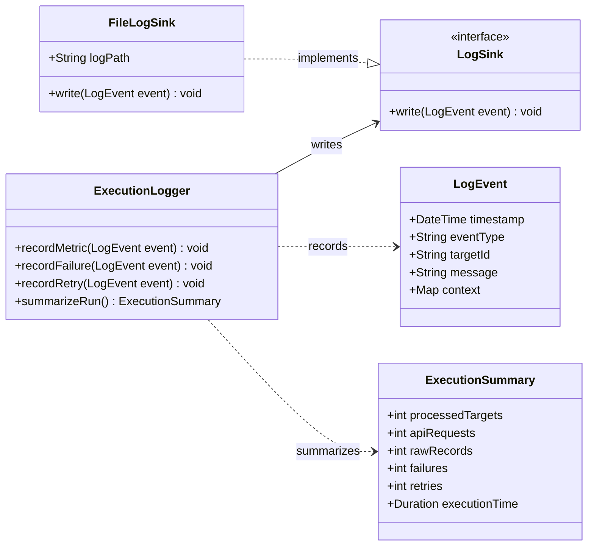

# Level 4 - Logger

```mermaid
classDiagram
direction LR

class ExecutionLogger {
  +recordMetric(LogEvent event) void
  +recordFailure(LogEvent event) void
  +recordRetry(LogEvent event) void
  +summarizeRun() ExecutionSummary
}

class LogSink {
  <<interface>>
  +write(LogEvent event) void
}

class FileLogSink {
  +String logPath
  +write(LogEvent event) void
}

class LogEvent {
  +DateTime timestamp
  +String eventType
  +String targetId
  +String message
  +Map context
}

class ExecutionSummary {
  +int processedTargets
  +int apiRequests
  +int rawRecords
  +int failures
  +int retries
  +Duration executionTime
}

ExecutionLogger --> LogSink : writes
ExecutionLogger ..> LogEvent : records
ExecutionLogger ..> ExecutionSummary : summarizes
FileLogSink ..|> LogSink : implements
```
