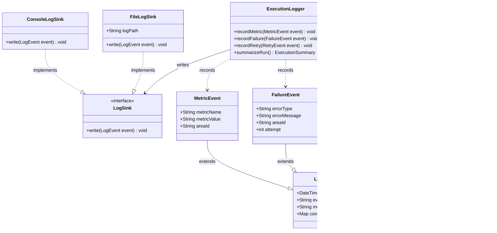

# Level 4 - Logger

```mermaid
classDiagram
direction TB

class ExecutionLogger {
  +recordMetric(MetricEvent event) void
  +recordFailure(FailureEvent event) void
  +recordRetry(RetryEvent event) void
  +summarizeRun() ExecutionSummary
}

class LogSink {
  <<interface>>
  +write(LogEvent event) void
}

class ConsoleLogSink {
  +write(LogEvent event) void
}

class FileLogSink {
  +String logPath
  +write(LogEvent event) void
}

class LogEvent {
  +DateTime timestamp
  +String eventType
  +String message
  +Map context
}

class MetricEvent {
  +String metricName
  +String metricValue
  +String areaId
}

class FailureEvent {
  +String errorType
  +String errorMessage
  +String areaId
  +int attempt
}

class RetryEvent {
  +String areaId
  +int attempt
  +int backoffSeconds
}

class ExecutionSummary {
  +int processedAreas
  +int aggregateRequests
  +int textSearchRequests
  +int failures
  +int retries
  +Duration executionTime
}

ExecutionLogger --> LogSink : writes
ExecutionLogger ..> MetricEvent : records
ExecutionLogger ..> FailureEvent : records
ExecutionLogger ..> RetryEvent : records
ExecutionLogger ..> ExecutionSummary : summarizes

ConsoleLogSink ..|> LogSink : implements
FileLogSink ..|> LogSink : implements

MetricEvent --|> LogEvent : extends
FailureEvent --|> LogEvent : extends
RetryEvent --|> LogEvent : extends
```
