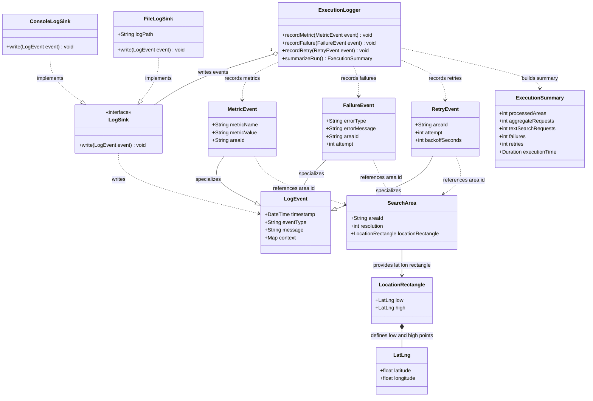

# Level 4 - Logger

```mermaid
classDiagram

class ExecutionLogger {
  +recordMetric(MetricEvent event) void
  +recordFailure(FailureEvent event) void
  +recordRetry(RetryEvent event) void
  +summarizeRun() ExecutionSummary
}

class LogSink {
  <<interface>>
  +write(LogEvent event) void
}

class ConsoleLogSink {
  +write(LogEvent event) void
}

class FileLogSink {
  +String logPath
  +write(LogEvent event) void
}

class LogEvent {
  +DateTime timestamp
  +String eventType
  +String message
  +Map context
}

class MetricEvent {
  +String metricName
  +String metricValue
  +String areaId
}

class FailureEvent {
  +String errorType
  +String errorMessage
  +String areaId
  +int attempt
}

class RetryEvent {
  +String areaId
  +int attempt
  +int backoffSeconds
}

class ExecutionSummary {
  +int processedAreas
  +int aggregateRequests
  +int textSearchRequests
  +int failures
  +int retries
  +Duration executionTime
}

class SearchArea {
  +String areaId
  +int resolution
  +LocationRectangle locationRectangle
}

class LocationRectangle {
  +LatLng low
  +LatLng high
}

class LatLng {
  +float latitude
  +float longitude
}

ExecutionLogger "1" o-- "*" LogSink : writes events
ExecutionLogger ..> MetricEvent : records metrics
ExecutionLogger ..> FailureEvent : records failures
ExecutionLogger ..> RetryEvent : records retries
ExecutionLogger ..> ExecutionSummary : builds summary

ConsoleLogSink ..|> LogSink : implements
FileLogSink ..|> LogSink : implements
LogSink ..> LogEvent : writes

MetricEvent --|> LogEvent : specializes
FailureEvent --|> LogEvent : specializes
RetryEvent --|> LogEvent : specializes

MetricEvent ..> SearchArea : references area id
FailureEvent ..> SearchArea : references area id
RetryEvent ..> SearchArea : references area id
SearchArea --> LocationRectangle : provides lat lon rectangle
LocationRectangle *-- LatLng : defines low and high points
```
