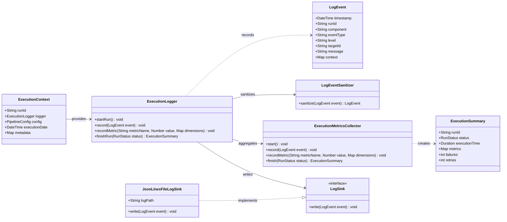

# Level 4 - Logger

```mermaid
classDiagram
direction LR

class ExecutionLogger {
  +startRun() void
  +record(LogEvent event) void
  +recordMetric(String metricName, Number value, Map dimensions) void
  +finishRun(RunStatus status) ExecutionSummary
}

class ExecutionContext {
  +String runId
  +ExecutionLogger logger
  +PipelineConfig config
  +DateTime executionDate
  +Map metadata
}

class LogEvent {
  +DateTime timestamp
  +String runId
  +String component
  +String eventType
  +String level
  +String targetId
  +String message
  +Map context
}

class LogEventSanitizer {
  +sanitize(LogEvent event) LogEvent
}

class ExecutionMetricsCollector {
  +start() void
  +record(LogEvent event) void
  +recordMetric(String metricName, Number value, Map dimensions) void
  +finish(RunStatus status) ExecutionSummary
}

class LogSink {
  <<interface>>
  +write(LogEvent event) void
}

class JsonLinesFileLogSink {
  +String logPath
  +write(LogEvent event) void
}

class ExecutionSummary {
  +String runId
  +RunStatus status
  +Duration executionTime
  +Map metrics
  +int failures
  +int retries
}

ExecutionContext --> ExecutionLogger : provides
ExecutionLogger --> LogEventSanitizer : sanitizes
ExecutionLogger --> ExecutionMetricsCollector : aggregates
ExecutionLogger --> LogSink : writes
ExecutionLogger ..> LogEvent : records
JsonLinesFileLogSink ..|> LogSink : implements
ExecutionMetricsCollector ..> ExecutionSummary : creates
```
