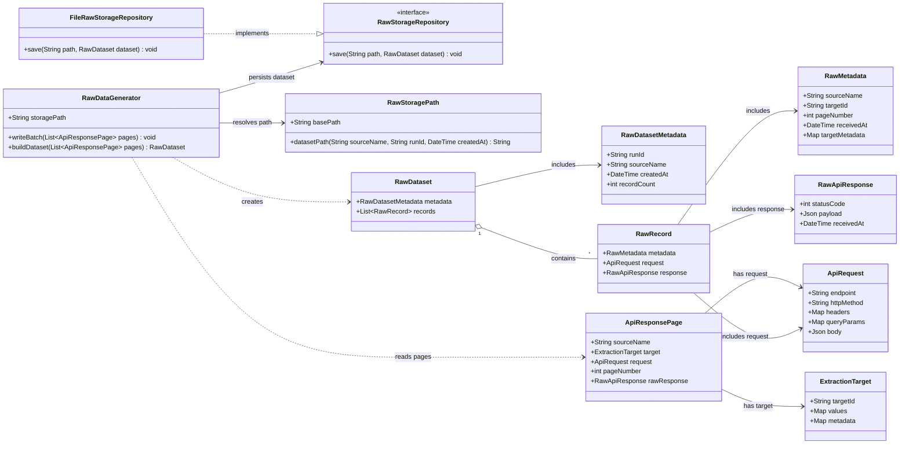

# Level 4 - Raw Data Generator

```mermaid
classDiagram
direction LR

class RawDataGenerator {
  +String storagePath
  +writeBatch(List~ApiResponsePage~ pages) void
  +buildDataset(List~ApiResponsePage~ pages) RawDataset
}

class RawStorageRepository {
  <<interface>>
  +save(String path, RawDataset dataset) void
}

class FileRawStorageRepository {
  +save(String path, RawDataset dataset) void
}

class RawStoragePath {
  +String basePath
  +datasetPath(String sourceName, String runId, DateTime createdAt) String
}

class RawDataset {
  +RawDatasetMetadata metadata
  +List~RawRecord~ records
}

class RawDatasetMetadata {
  +String runId
  +String sourceName
  +DateTime createdAt
  +int recordCount
}

class RawRecord {
  +RawMetadata metadata
  +ApiRequest request
  +RawApiResponse response
}

class RawMetadata {
  +String sourceName
  +String targetId
  +int pageNumber
  +DateTime receivedAt
  +Map targetMetadata
}

class ApiResponsePage {
  +String sourceName
  +ExtractionTarget target
  +ApiRequest request
  +int pageNumber
  +RawApiResponse rawResponse
}

class ExtractionTarget {
  +String targetId
  +Map values
  +Map metadata
}

class ApiRequest {
  +String endpoint
  +String httpMethod
  +Map headers
  +Map queryParams
  +Json body
}

class RawApiResponse {
  +int statusCode
  +Json payload
  +DateTime receivedAt
}

RawDataGenerator --> RawStoragePath : resolves path
RawDataGenerator --> RawStorageRepository : persists dataset
RawDataGenerator ..> RawDataset : creates
RawDataGenerator ..> ApiResponsePage : reads pages
FileRawStorageRepository ..|> RawStorageRepository : implements
RawDataset --> RawDatasetMetadata : includes
RawDataset "1" o-- "*" RawRecord : contains
RawRecord --> RawMetadata : includes
RawRecord --> ApiRequest : includes request
RawRecord --> RawApiResponse : includes response
ApiResponsePage --> ExtractionTarget : has target
ApiResponsePage --> ApiRequest : has request
```
