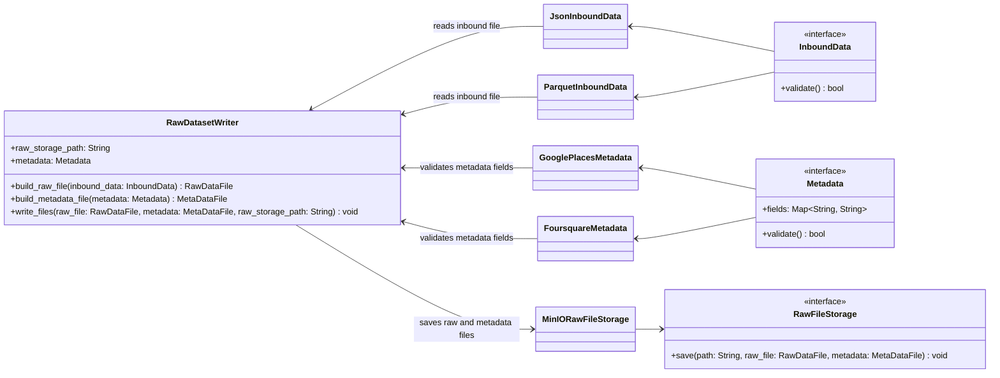

# Level 4 - Raw Dataset Writer New

Este diagrama de Level 4 Code/UML sugere uma estrutura minima para criar e persistir dois arquivos a partir de um arquivo de entrada recebido de qualquer origem: um arquivo RAW e um arquivo de metadata. O arquivo RAW e gerado diretamente a partir de `InboundData`, sem uma representacao UML propria. `Metadata` valida os campos usados para gerar o arquivo de metadata, e `write_files()` recebe `InboundData`, `Metadata` e o `raw_storage_path` para persistencia. A POC busca preservar os dados recebidos sem fixar o formato fisico dos arquivos ou modelar todos os metadados finais.

## Assumptions

- O formato fisico dos arquivos ainda nao esta definido.
- `InboundData` representa uma interface para um arquivo de entrada generico, sem acoplar o writer a respostas HTTP ou a um payload especifico.
- O arquivo RAW continua existindo conceitualmente, mas nao aparece como classe ou artefato no UML.
- `Metadata` representa uma interface para validar os campos usados para gerar o arquivo de metadata.
- `RawFileStorage` representa uma interface para validar a persistencia e salvar o arquivo RAW a partir de `InboundData` junto com o arquivo de metadata a partir de `Metadata`.
- `raw_storage_path` fica como atributo do writer porque a POC nao precisa de uma classe propria para resolver caminho.
- Os campos exatos de `metadata` serao definidos depois.
