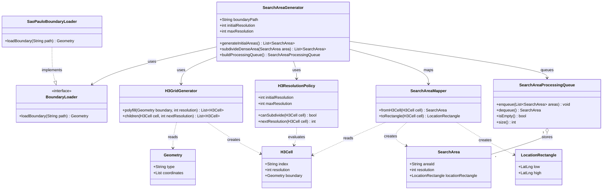

# Level 4 - Search Area Generator

```mermaid
classDiagram
direction TB

class SearchAreaGenerator {
  +String boundaryPath
  +int initialResolution
  +int maxResolution
  +generateInitialAreas() List~SearchArea~
  +subdivideDenseArea(SearchArea area) List~SearchArea~
  +buildProcessingQueue() SearchAreaProcessingQueue
}

class BoundaryLoader {
  <<interface>>
  +loadBoundary(String path) Geometry
}

class SaoPauloBoundaryLoader {
  +loadBoundary(String path) Geometry
}

class H3GridGenerator {
  +polyfill(Geometry boundary, int resolution) List~H3Cell~
  +children(H3Cell cell, int nextResolution) List~H3Cell~
}

class H3ResolutionPolicy {
  +int initialResolution
  +int maxResolution
  +canSubdivide(H3Cell cell) bool
  +nextResolution(H3Cell cell) int
}

class SearchAreaMapper {
  +fromH3Cell(H3Cell cell) SearchArea
  +toRectangle(H3Cell cell) LocationRectangle
}

class SearchAreaProcessingQueue {
  +enqueue(List~SearchArea~ areas) void
  +dequeue() SearchArea
  +isEmpty() bool
  +size() int
}

class SearchArea {
  +String areaId
  +int resolution
  +LocationRectangle locationRectangle
}

class H3Cell {
  +String index
  +int resolution
  +Geometry boundary
}

class Geometry {
  +String type
  +List coordinates
}

class LocationRectangle {
  +LatLng low
  +LatLng high
}

SearchAreaGenerator --> BoundaryLoader : uses
SearchAreaGenerator --> H3GridGenerator : uses
SearchAreaGenerator --> H3ResolutionPolicy : uses
SearchAreaGenerator --> SearchAreaMapper : maps
SearchAreaGenerator --> SearchAreaProcessingQueue : queues

SaoPauloBoundaryLoader ..|> BoundaryLoader : implements
H3GridGenerator ..> Geometry : reads
H3GridGenerator ..> H3Cell : creates
H3ResolutionPolicy ..> H3Cell : evaluates
SearchAreaMapper ..> H3Cell : reads
SearchAreaMapper ..> SearchArea : creates
SearchAreaMapper ..> LocationRectangle : creates
SearchAreaProcessingQueue "1" o-- "*" SearchArea : stores
```
