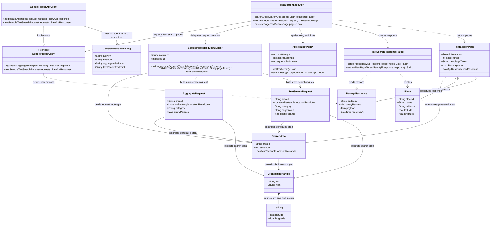

# Level 4 - Text Search Executor

```mermaid
classDiagram

class TextSearchExecutor {
  +searchArea(SearchArea area) List~TextSearchPage~
  +fetchPage(TextSearchRequest request) TextSearchPage
  +hasNextPage(TextSearchPage page) bool
}

class GooglePlacesRequestBuilder {
  +String category
  +int pageSize
  +buildAggregateRequest(SearchArea area) AggregateRequest
  +buildTextSearchRequest(SearchArea area, String pageToken) TextSearchRequest
}

class GooglePlacesClient {
  <<interface>>
  +aggregate(AggregateRequest request) RawApiResponse
  +textSearch(TextSearchRequest request) RawApiResponse
}

class GooglePlacesApiClient {
  +aggregate(AggregateRequest request) RawApiResponse
  +textSearch(TextSearchRequest request) RawApiResponse
}

class GooglePlacesApiConfig {
  +String apiKey
  +String baseUrl
  +String aggregateEndpoint
  +String textSearchEndpoint
}

class ApiRequestPolicy {
  +int maxAttempts
  +int backoffSeconds
  +int requestsPerMinute
  +waitForPermit() void
  +shouldRetry(Exception error, int attempt) bool
}

class TextSearchRequest {
  +String areaId
  +LocationRectangle locationRestriction
  +String category
  +String pageToken
  +Map queryParams
}

class AggregateRequest {
  +String areaId
  +LocationRectangle locationRestriction
  +String category
  +Map queryParams
}

class TextSearchPage {
  +SearchArea area
  +int pageNumber
  +String nextPageToken
  +List~Place~ places
  +RawApiResponse rawResponse
}

class TextSearchResponseParser {
  +parsePlaces(RawApiResponse response) List~Place~
  +extractNextPageToken(RawApiResponse response) String
}

class SearchArea {
  +String areaId
  +int resolution
  +LocationRectangle locationRectangle
}

class LocationRectangle {
  +LatLng low
  +LatLng high
}

class LatLng {
  +float latitude
  +float longitude
}

class Place {
  +String placeId
  +String name
  +String address
  +float latitude
  +float longitude
}

class RawApiResponse {
  +String endpoint
  +Map queryParams
  +Json payload
  +DateTime receivedAt
}

TextSearchExecutor --> GooglePlacesClient : requests text search pages
TextSearchExecutor --> GooglePlacesRequestBuilder : delegates request creation
TextSearchExecutor --> ApiRequestPolicy : applies retry and limits
TextSearchExecutor --> TextSearchResponseParser : parses response
TextSearchExecutor ..> TextSearchPage : returns pages

GooglePlacesRequestBuilder --> SearchArea : reads request rectangle
GooglePlacesRequestBuilder ..> AggregateRequest : builds aggregate request
GooglePlacesRequestBuilder ..> TextSearchRequest : builds text search request

GooglePlacesApiClient ..|> GooglePlacesClient : implements
GooglePlacesApiClient --> GooglePlacesApiConfig : reads credentials and endpoints
GooglePlacesClient ..> RawApiResponse : returns raw payload

TextSearchRequest --> SearchArea : describes generated area
TextSearchRequest --> LocationRectangle : restricts search area
AggregateRequest --> SearchArea : describes generated area
AggregateRequest --> LocationRectangle : restricts search area
TextSearchPage --> SearchArea : references generated area
TextSearchPage "1" o-- "*" Place : contains places
TextSearchPage --> RawApiResponse : preserves response
TextSearchResponseParser ..> RawApiResponse : reads payload
TextSearchResponseParser ..> Place : creates
SearchArea --> LocationRectangle : provides lat lon rectangle
LocationRectangle *-- LatLng : defines low and high points
```
