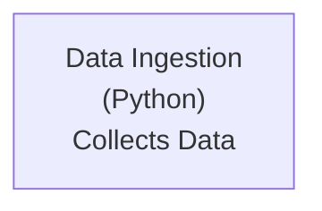
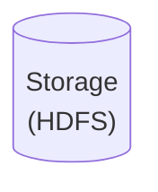
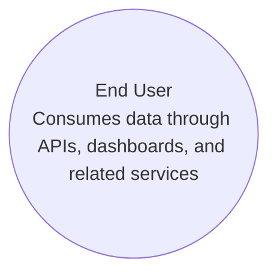
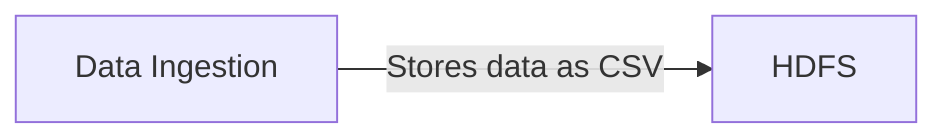
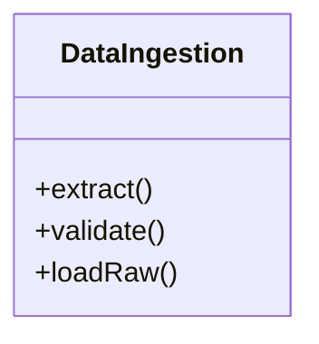
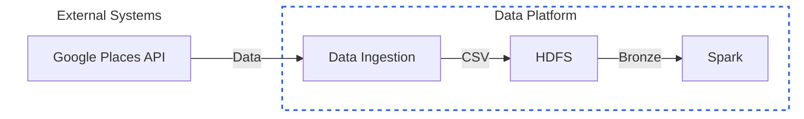
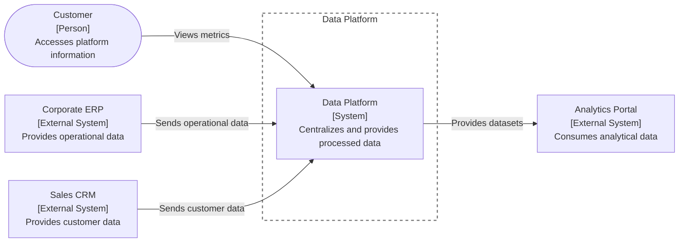
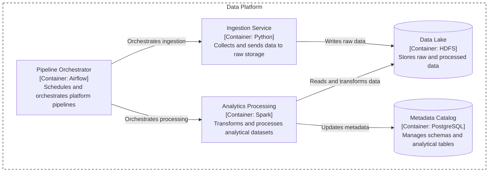
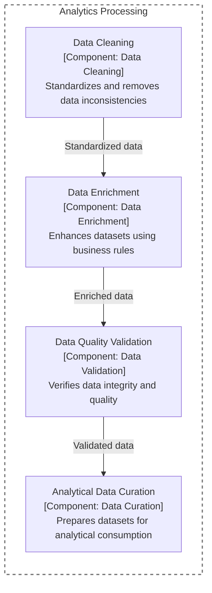

# Diagram Standardization

## Objective

Define a visual standard for data platform diagrams, ensuring:

- Consistency
    
- Readability
    
- Ease of maintenance
    
- Quick understanding of the architecture
    

Diagrams should follow the following standards:

- C4 Model
    
- Flowchart
    

---

# Element Standards

## 1. Entities (Rectangle)

Represent systems, services, applications, or processes.

### Example



## Storage (Cylinder)

Represents data storage units.

### Example



## Actors (Circle)

Represent users, consumers, or systems that interact with the platform.

### Example



---

## Solid Arrow

Represents:

- Data flow
    
- Communication
    
- Action execution
    
- Read/write operations
    
- Relationships
    

Recommended format:

```
Verb + object
```

Examples:

- Sends events
    
- Queries metrics
    
- Persists raw data
    
- Publishes metrics
    

Avoid:

- Data
    
- Flow
    
- Communication
    
- Integration
    

### Example



## UML

Class Diagram

### Example



---

# Boundary Definition

Boundaries should clearly separate:

- Internal systems
    
- External systems
    
- Architectural domains
    

## Boundary Definition Example



---

# Rules by Level

## Level 1 — Context

### Rule

Do not include technical implementation details.

### Format

```
Name
[Type]
Description
```

Standard:

- Real system or role name
    
- No technologies
    
- No generic terms
    

### Example



---

# Level 2 — Container

### Format

```
Name
[Container: Technology]
Description
```

### Rules

- Functional container name
    
- Technology is allowed
    
- Clear responsibility
    
- Avoid generic names
    

### Example



---

# Level 3 — Component

## Naming Convention

### Format

```
Name
[Component]
Description
```

### Rules

- Internal module name
    
- Functional focus
    
- Represents a specific responsibility
    
- Avoid implementation details
    

### Example



---

# Level 4 — Code / UML

## Rule

Show:

- Classes
    
- Interfaces
    
- Methods
    
- Attributes
    
- Relationships