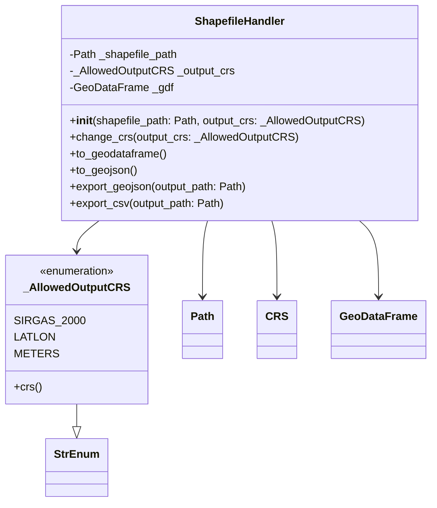

# Classe ShapefileHandler

## Visão geral

A classe `ShapefileHandler` fornece uma interface para carregar,
manipular e exportar dados de um Shapefile.

Durante a inicialização:

1. O shapefile é carregado usando GeoPandas.
2. O CRS do arquivo é verificado.
3. Os dados são reprojetados para o CRS definido pelo sistema.

Os dados são mantidos internamente em um `GeoDataFrame`.

---

## Diagrama de classes

---

## Responsabilidades da classe

- Carregar shapefile
- Validar CRS
- Reprojetar geometria
- Exportar dados

---

## Atributos principais

### `_shapefile_path`

Armazena o caminho do arquivo shapefile de origem.

### `_output_crs`

Armazena o CRS de saída permitido pela regra de negócio.

### `_gdf`

Armazena o GeoDataFrame carregado e normalizado internamente.

---

## Métodos públicos

### `change_crs`

Reprojeta o GeoDataFrame interno para outro CRS permitido.

### `to_geodataframe`

Retorna uma cópia do GeoDataFrame interno.

### `to_geojson`

Serializa os dados para uma string GeoJSON.

### `export_geojson`

Exporta os dados para um arquivo GeoJSON.

### `export_csv`

Exporta os dados para CSV convertendo a geometria para formato WKT.