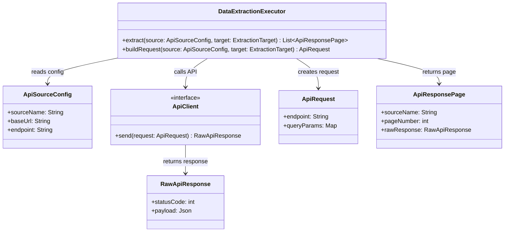

# Data Extraction - POC Code Model

Este diagrama sugere uma estrutura minima para montar chamadas de API e guardar respostas brutas. A POC foca no caminho principal: alvo de busca, requisicao e resposta.

## Classes principais

- `DataExtractionExecutor`: coordena a chamada da fonte externa.
- `ApiSourceConfig`: guarda configuracao basica da API.
- `ApiClient`: interface para permitir chamada real ou simulada.
- `ApiRequest`: requisicao pronta para envio.
- `ApiResponsePage`: resposta com contexto minimo de fonte e pagina.
- `RawApiResponse`: payload bruto retornado pela API.

## Assumptions

- Autenticacao, retry, timeout e paginacao detalhada ficam fora desta POC.
- `ExtractionTarget` vem do bloco `SearchAreaGenerator`.
- As assinaturas podem mudar quando uma fonte real for escolhida.
