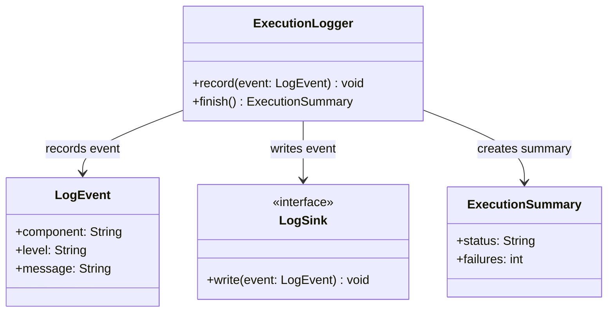

# Execution Logger - POC Code Model

Este diagrama sugere uma estrutura minima para registrar eventos simples da execucao. A POC nao tenta definir uma solucao completa de observabilidade.

## Classes principais

- `ExecutionLogger`: interface simples para registrar eventos.
- `LogEvent`: evento estruturado minimo.
- `LogSink`: destino abstrato de log.
- `ExecutionSummary`: resumo basico da execucao.

## Assumptions

- Logs estruturados completos podem ser definidos depois.
- Sanitizacao, metricas e multiplos destinos ficam fora da POC.
- O objetivo inicial e apenas saber se o fluxo executou e onde falhou.
