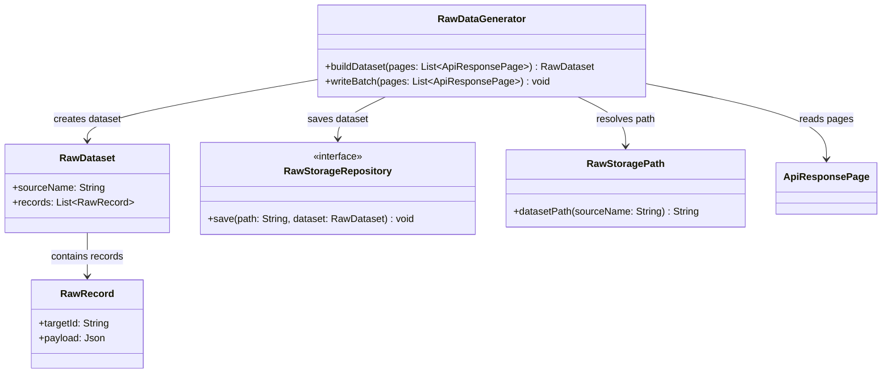

# Raw Data Generator - POC Code Model

Este diagrama sugere uma estrutura minima para transformar respostas de API em dados brutos persistidos. A POC busca preservar o payload recebido sem modelar todos os metadados finais.

## Classes principais

- `RawDataGenerator`: monta e salva o dataset bruto.
- `RawDataset`: pacote simples de registros brutos.
- `RawRecord`: payload bruto associado a um alvo.
- `RawStorageRepository`: destino abstrato de persistencia.
- `RawStoragePath`: regra simples para montar o caminho de saida.

## Assumptions

- O formato fisico do arquivo ainda nao esta definido.
- Metadados completos podem ser adicionados depois.
- `ApiResponsePage` vem do bloco `DataExtractionExecutor`.
