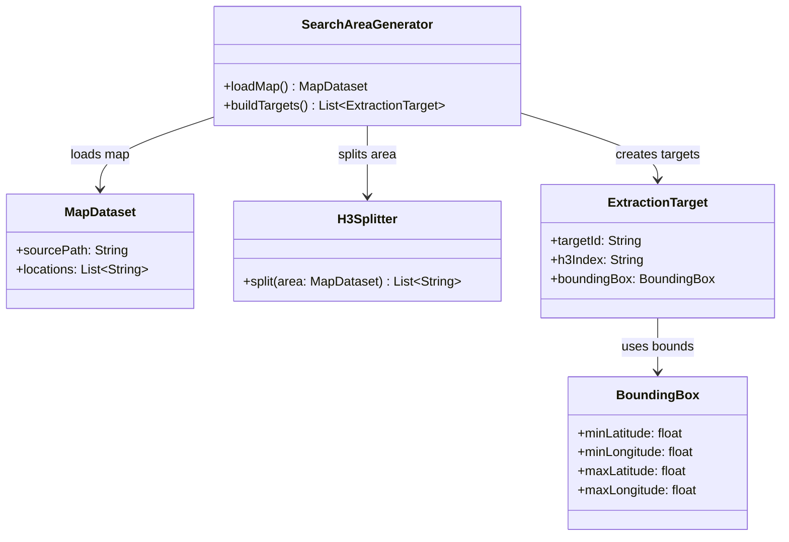

# Search Area Generator - POC Code Model

Este diagrama sugere uma estrutura minima para transformar uma area geografica em alvos de busca. A ideia e validar o fluxo, nao fechar a implementacao final.

## Classes principais

- `SearchAreaGenerator`: ponto de entrada da POC para ler o mapa e criar alvos.
- `MapDataset`: representacao simples do mapa carregado.
- `H3Splitter`: ideia inicial para quebrar areas grandes em celulas menores.
- `BoundingBox`: recorte geografico simples usado por APIs.
- `ExtractionTarget`: alvo que sera enviado para a etapa de extracao.

## Assumptions

- O formato real do mapa ainda sera definido.
- A divisao H3 pode ser removida se a POC mostrar que nao e necessaria.
- As assinaturas sao exemplos para discutir o desenho.
